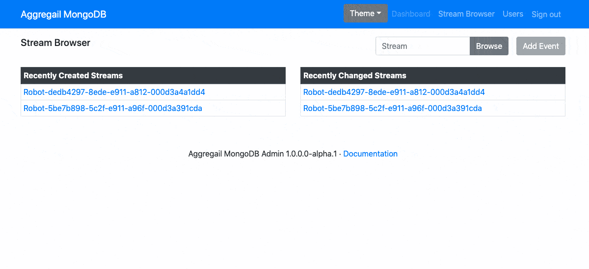

# Aggregail Admin UI (MongoDB)

An administration UI for event stores built using [Aggregail.MongoDB](../Aggregail.MongoDB).



## Getting started

 1. Download the latest [Release](https://github.com/Nillerr/EventSourcing.Demo/releases).
 2. Unzip
 3. Start the application:
    ```bash
    dotnet Aggregail.MongoDB.Admin.dll \
      --ConnectionString=<Your MongoDB Connection String> \
      --Database=<Your Database> \
      --Collection=<Your Streams Collection>
    ```
     - `--Database` defaults to `aggregail`
     - `--Collection` defaults to `streams`
     - The arguments can also be specified using [environment variables](#environment-variables)
 4. Log in with the user `admin` and password `changeit`.
 5. By default the application will launch on the urls: `http://localhost:5000` and 
    `https://localhost:5001`. This can be changed by specifying the `--urls` command line argument:
    ```bash
    dotnet Aggregail.MongoDB.Admin.dll \
      --urls=http://localhost:3014
    ``` 
    
The application will create a new collection called `users` in the database specified when 
launching the application, containing a single user `admin` with the password `changeit`.
 
### Environment Variables

The application can also be configured using these environment variables:

```sh
AGGREGAIL__ConnectionString=<Your MongoDB Connection String>
AGGREGAIL__Database=<Your Database>
AGGREGAIL__Collection=<Your Streams Collection>

ASPNETCORE__Urls=<Your launch urls>
```

## Troubleshooting

The application is by no means perfect, and several corners have been cut in an effort to 
get a minimal viable product ready. Here are some of the known issues you might experience.

### Some buttons are always disabled

There are several features that haven't been implemented yet, some of which may yet be 
dropped. The buttons are there only to confuse you.

#### I can't change a user password

Changing user password is one of the features that haven't been implemented yet. The 
suggested workaround is to delete and and create the user again with the same username and 
a new password.

### All users have been deleted

Restarting the application, while there are no users in the `users` MongoDB collection, will 
re-create the default `admin` user, with the password `changeit`.

### I have been locked out

 1. Connect to your MongoDB server
 2. Open the database specified when launching the application
 3. Delete the `users` collection
 4. See [All users have been deleted](#all-users-have-been-deleted)
 
### Missing UI / Theme / Stylesheet

If a mismatch occurs with the `localStorage` keys `theme` and `theme-style` vs the provided 
themes in the application, there's not implemented any nice fallback, and as such, the UI will 
look very pale. Delete those `localStorage` keys to restore the default theme and style, or 
clear all site data.

### My theme is not synchronized with my user

The selected theme is stored in `localStorage`, and will not be synchronized with your user 
login.   
